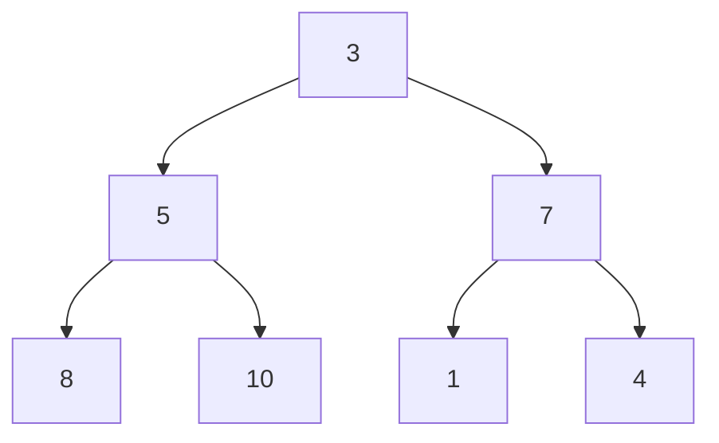

# Arama-Sıralama Algoritmaları
Girdi dizimiz şudur: En yüksek değerden başlayarak azalana kadar sıralama yapacağız.

Bir parent(ebeveyn) sağ ve sol child(çoçuklar) değerlerini indekslememiz lazım. Büyük ve küçüktür karşılaştırması için

2 * indeks + 1 sol child(çoçuk) değerini verir.

2 * index +  2 sağ child(çoçuk) değerini verir.

parent ise n - 1 / 2 değeri verir. Örnek vermek gerekirse şekile bakarsak

Kutu içinde 5 değerini bakarsak indeksi 1'dir. Burada sol ve sağ çoçuklarına bakarsak;

2 * 1 + 1 = 3. indeks = 8'dir.

2 * 1 + 1 = 4.indeks = 10'dur.

Kodlama dizeleri bu yöntemle gezini parent ve çoçuk arasında karşılaştırma yaparak yerleri değiştirip sıralamayı oluşturacaktır. Anlaşılmadı ise kod
üzerinde daha kolay anlaşılacaktır.


```
class MaxHeap{
    constructor(){
        this.heap = [];
    }

    parentIndex(index){
        return Math.floor((index - 1) / 2) ;
    }
    right_child(index){
      return 2 * index + 2
    }
    left_child(index){
      return 2 * index + 1;
    }
```
Görüldüğü gibi heap alanı dizelerimizi buraya katarıp tek tek karşılaştırma yapmamızı sağlayacak. Diğer metotlar yukarıdaki anlatılan formulleri kullanmamızı sağlayacaktır.

```
insert(item){
        this.heap.push(item);
        let index = this.heap.length - 1;
        let parent = this.parentIndex(index);
        while(this.heap[parent] && this.heap[parent] < this.heap[index]){
            this.swap(parent, index);
            index = this.parentIndex(index);
            parent = this.parentIndex(index)
        }
        
    }

```
