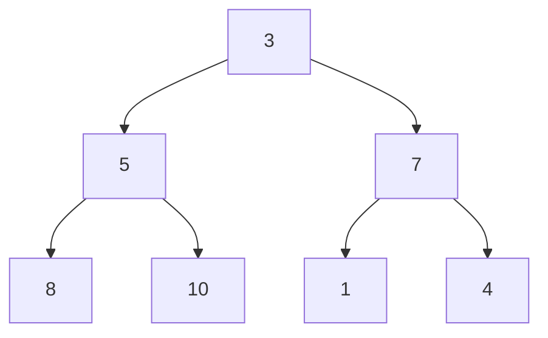
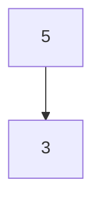
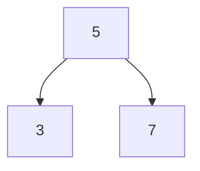
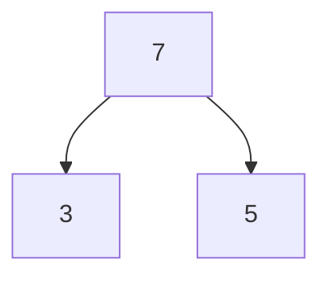

# Arama-Sıralama Algoritmaları
## Heap Algoritması
Karmaşıklık durumu O(nlogn)

Girdi dizimiz şudur: En yüksek değerden başlayarak azalana kadar sıralama yapacağız.


| Elemanlar|
| ------------------------| 
|  [3, 5, 7, 8, 10, 1, 4] |
|                         |



Bir parent(ebeveyn) sağ ve sol child(çoçuklar) değerlerini indekslememiz lazım. Büyük ve küçüktür karşılaştırması için

2 * indeks + 1 sol child(çoçuk) değerini verir.

2 * index +  2 sağ child(çoçuk) değerini verir.

parent ise n - 1 / 2 değeri verir. Örnek vermek gerekirse şekile bakarsak

Kutu içinde 5 değerini bakarsak indeksi 1'dir. Burada sol ve sağ çoçuklarına bakarsak;

2 * 1 + 1 = 3. indeks = 8'dir.

2 * 1 + 1 = 4.indeks = 10'dur.

Kodlama dizeleri bu yöntemle gezini parent ve çoçuk arasında karşılaştırma yaparak yerleri değiştirip sıralamayı oluşturacaktır. Anlaşılmadı ise kod
üzerinde daha kolay anlaşılacaktır.


```
class MaxHeap{
    constructor(){
        this.heap = [];
    }

    parentIndex(index){
        return Math.floor((index - 1) / 2) ;
    }
    right_child(index){
      return 2 * index + 2
    }
    left_child(index){
      return 2 * index + 1;
    }
    
    swap(a, b){
      temp = this.heap[a];
      this.heap[a] = this.heap[b]
      this.heap[b] = temp;
    }
    
    
    
```
insert metodumuzun parametresi ekleyeceğimiz her dize üyeleri üzerine işlem yapacaktır. Kodu inceleyelim.

İndex değişkeni en son eklenen elemanın uzunluğunu döndürür. parentIndex(index) ile ebeveyn belirleriz.

Şartımızla parent ve child arasında büyüklük karşılaştırması yaparız. Swap büyük değeri küçük değerin yerini değiştirir.


```
insert(item){
        this.heap.push(item);
        let index = this.heap.length - 1;
        let parent = this.parentIndex(index);
        while(this.heap[parent] && this.heap[parent] < this.heap[index]){
            this.swap(parent, index);
            index = this.parentIndex(index);
            parent = this.parentIndex(index)
        }
        
    }

```

ilk elemanımız eklenir 3'ün parent'ı aranır -1 döndürür ve undefine olarak döner. Yani metotdan çıkılır işlem yapılmaz. 5'i eklediğimizde while() 

döngüsüne gelin 3 ve 5 karşılaştırılır. Yeni indeksimiz 5'in olduğu indeks ve yeni indeksimizin parent'ı aranır. Ama yine -1 indeksi arar undefined 

ile döngüden çıkılır. Yeni graph nasıl olur peki?



7 eklediğimizdeki durum.


İndeksimiz 2'dir. 7 sayısının parent'ını bulmamız lazım. Yani parentIndex(index) Math.floor((2 - 1) / 2)) ile parent 0. indeksi olur.

5 ve 7 karşılaştırılır. 7 büyüktür ve swap() metodumuz ile yerleri değişir. Yeni indeksimiz 0, değerimiz 7'nin parent'ını değişkene atamak olur. Ama yoktur ve undefined döndürür. 

Yeni tablomuz şöyledir

Diğer elemanlar içinde aynısı böyledir.


Küçük bir kod gezintisine çıkalım:

Heap alanına ve frame kısmını dikkatle izleyerek kodu yorumlayabilirsiniz. 

https://user-images.githubusercontent.com/61328016/215583000-5d6aa875-006b-4502-be0c-699cd09e9b6e.gif


